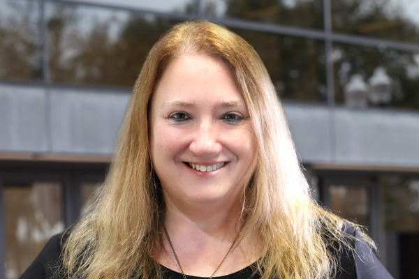

# Cheryl Briggs
## Professor
This is my Intro to T&T repository using GitHub Desktop and Visual Studio Code.

### Contact
Email: animator@ucf.edu

Office: Communication and Media Building #150, Downtown Campus

### Follow Me

[LinkedIn](https://www.linkedin.com/in/cherylc1/)

[YouTube](https://www.youtube.com/@themayamagician595)

[GitHub](https://github.com/ProfessorBriggs) 

### About Me
[CV](Briggs_CV.md)

I am a Professor of Animation, Level Design, and Motion Capture Engineer, Florida Interactive Entertainment Academy, in the Nicholson School of Communication and Media. I came to UCF in Fall of 2009 as founding faculty of Character Animation and served as Area Coordinator from 2014-2022. I was founding faculty of the Animation and Visual Effects program and served as Program Director from 2016-2022. Prior to UCF, I taught as Professor of Animation at the Savannah College of Art and Design from 2001 to 2009 where I was Mocap Engineer for the Animation Department since 2005. There, I developed and taught a graduate level animation course focusing on the use of motion capture in film and games.

​I received my MFA in Computer Art: 3D Animation from the Savannah College of Art and Design in 2001. I have published several single-authored books and am an Autodesk Certified Professional and an Autodesk Certified Instructor in Maya since 2005. As an award-winning animation producer and director, my students have been featured in animation festivals worldwide, and many have gone on to work within the film, television, and video game industries at studios such as Dreamworks, Disney, PIXAR, Blue Sky, ILM, MPC, R&H, DD, Blizzard, Epic, and Hi-Rez. You can find a portfolio of professional work and student work here www.cherylcreates.com

I am currently on the Board of Directors for the Animation Hall of Fame, the Education Committee for ACM-SIGGRAPH, and  an active member of the Visual Effects Society, ASIFA-Hollywood, Women in Animation, and the Society for Animation Studies.

My favorite animated quote:
Dory: [singing] Just keep swimming. Just keep swimming. Just keep swimming, swimming, swimming. What do we do? We swim, swim

