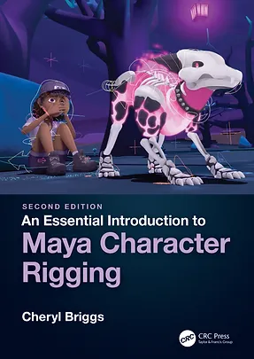
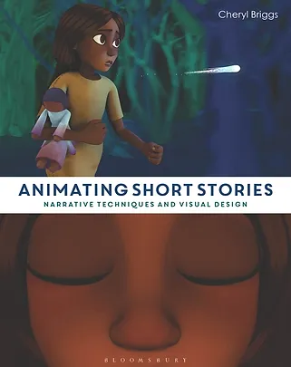
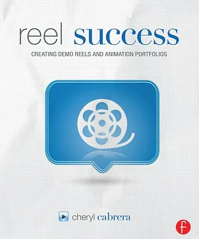
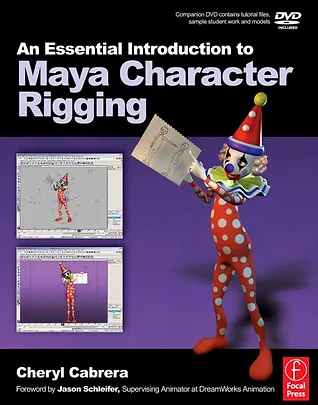

[click here for Maya Character Rigging 2nd ed.](https://www.routledge.com/An-Essential-Introduction-to-Maya-Character-Rigging/Briggs/p/book/9781138777989?gclsrc=aw.ds&utm_source=cjaffiliates&utm_medium=affiliates&cjevent=d75cdc49671d11ec839803340a82b82d)

[click here for Animated Storytelling](https://www.bloomsbury.com/us/animating-short-stories-9781472570154/)

[click here for Reel Success](https://www.routledge.com/Reel-Success-Creating-Demo-Reels-and-Animation-Portfolios/Cabrera/p/book/9780240821023)

[click here for Maya Character Rigging 1st ed.](https://www.routledge.com/An-Essential-Introduction-to-Maya-Character-Rigging-with-DVD/Cabrera/p/book/9780429214011)

